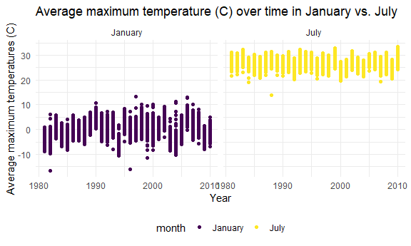
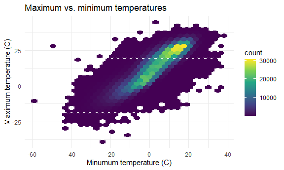
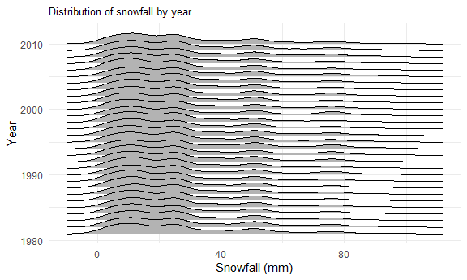

Homework 3
================
Shelley Shen
10/6/2020

## Problem 1 (from class)

Load Instacart data.

``` r
data("instacart")
```

This dataset contains 1384617 rows and 15 columns.

Observations are the level of items in orders by user. There are user
and order variables with user ID, order ID, order day, and order hour.
There are also item variables including name, aisle, department, and
some numeric codes.

How many aisles, and which are most items from?

``` r
instacart %>% 
  count(aisle) %>% 
  arrange(desc(n))
```

    ## # A tibble: 134 x 2
    ##    aisle                              n
    ##    <chr>                          <int>
    ##  1 fresh vegetables              150609
    ##  2 fresh fruits                  150473
    ##  3 packaged vegetables fruits     78493
    ##  4 yogurt                         55240
    ##  5 packaged cheese                41699
    ##  6 water seltzer sparkling water  36617
    ##  7 milk                           32644
    ##  8 chips pretzels                 31269
    ##  9 soy lactosefree                26240
    ## 10 bread                          23635
    ## # ... with 124 more rows

Let’s make a plot of the number of items ordered in each aisle, limited
to those aisles with \>10,000 items ordered.

``` r
instacart %>% 
  count(aisle) %>% 
  filter(n > 10000) %>% 
  mutate(
    aisle = factor(aisle),
    aisle = fct_reorder(aisle, n)
  ) %>% 
  ggplot(aes(x = aisle, y = n)) +
  geom_point() +
  theme(axis.text.x = element_text(angle = 90, vjust = 0.5, hjust = 1))
```


Make a table of most popular items in each aisle of interest: baking
ingredients, dog food, packaged vegetables fruits.

``` r
instacart %>% 
  filter(aisle %in% c("baking ingredients", "dog food care", "packaged vegetables fruits")) %>%
  group_by(aisle) %>% 
  count(product_name) %>%
  mutate(rank = min_rank(desc(n))) %>% 
  filter(rank < 4) %>% 
  arrange(aisle, rank) %>% 
  knitr::kable()
```

| aisle                      | product\_name                                 |    n | rank |
| :------------------------- | :-------------------------------------------- | ---: | ---: |
| baking ingredients         | Light Brown Sugar                             |  499 |    1 |
| baking ingredients         | Pure Baking Soda                              |  387 |    2 |
| baking ingredients         | Cane Sugar                                    |  336 |    3 |
| dog food care              | Snack Sticks Chicken & Rice Recipe Dog Treats |   30 |    1 |
| dog food care              | Organix Chicken & Brown Rice Recipe           |   28 |    2 |
| dog food care              | Small Dog Biscuits                            |   26 |    3 |
| packaged vegetables fruits | Organic Baby Spinach                          | 9784 |    1 |
| packaged vegetables fruits | Organic Raspberries                           | 5546 |    2 |
| packaged vegetables fruits | Organic Blueberries                           | 4966 |    3 |

Make table for mean hour of day when Pink Lady Apples and Coffee Ice
Cream are ordered on each day of the week

``` r
instacart %>% 
  filter(product_name %in% c("Pink Lady Apples", "Coffee Ice Cream")) %>% 
  group_by(product_name, order_dow) %>% 
  summarize(mean_hour = mean(order_hour_of_day)) %>% 
  pivot_wider(
    names_from = order_dow,
    values_from = mean_hour
  )
```

    ## `summarise()` regrouping output by 'product_name' (override with `.groups` argument)

    ## # A tibble: 2 x 8
    ## # Groups:   product_name [2]
    ##   product_name       `0`   `1`   `2`   `3`   `4`   `5`   `6`
    ##   <chr>            <dbl> <dbl> <dbl> <dbl> <dbl> <dbl> <dbl>
    ## 1 Coffee Ice Cream  13.8  14.3  15.4  15.3  15.2  12.3  13.8
    ## 2 Pink Lady Apples  13.4  11.4  11.7  14.2  11.6  12.8  11.9

## Problem 2

**Part 1**

Load in the accelerometer data and tidy.

``` r
accel_df = 
  read_csv("./data/accel_data.csv") %>% 
  janitor::clean_names() %>% 
  pivot_longer(
    activity_1:activity_1440,
    names_to = "minute",
    names_prefix = "activity_",
    values_to = "activity_count") %>% 
  group_by(day) %>% 
  mutate(
    minute = as.numeric(minute), 
    day = as.factor(day),
    activity_count = as.numeric(activity_count),
    day = forcats::fct_relevel(day, c("Sunday", "Monday", "Tuesday", "Wednesday", "Thursday", "Friday", "Saturday")),
    weekday_vs_weekend = if_else(day %in% c("Saturday", "Sunday"), "Weekend", "Weekday"))
```

    ## Parsed with column specification:
    ## cols(
    ##   .default = col_double(),
    ##   day = col_character()
    ## )

    ## See spec(...) for full column specifications.

    ## Warning: Problem with `mutate()` input `day`.
    ## i Unknown levels in `f`: Sunday, Monday, Tuesday, Wednesday, Thursday, Saturday
    ## i Input `day` is `forcats::fct_relevel(...)`.
    ## i The error occurred in group 1: day = "Friday".

    ## Warning: Unknown levels in `f`: Sunday, Monday, Tuesday, Wednesday, Thursday,
    ## Saturday

    ## Warning: Problem with `mutate()` input `day`.
    ## i Unknown levels in `f`: Sunday, Tuesday, Wednesday, Thursday, Friday, Saturday
    ## i Input `day` is `forcats::fct_relevel(...)`.
    ## i The error occurred in group 2: day = "Monday".

    ## Warning: Unknown levels in `f`: Sunday, Tuesday, Wednesday, Thursday, Friday,
    ## Saturday

    ## Warning: Problem with `mutate()` input `day`.
    ## i Unknown levels in `f`: Sunday, Monday, Tuesday, Wednesday, Thursday, Friday
    ## i Input `day` is `forcats::fct_relevel(...)`.
    ## i The error occurred in group 3: day = "Saturday".

    ## Warning: Unknown levels in `f`: Sunday, Monday, Tuesday, Wednesday, Thursday,
    ## Friday

    ## Warning: Problem with `mutate()` input `day`.
    ## i Unknown levels in `f`: Monday, Tuesday, Wednesday, Thursday, Friday, Saturday
    ## i Input `day` is `forcats::fct_relevel(...)`.
    ## i The error occurred in group 4: day = "Sunday".

    ## Warning: Unknown levels in `f`: Monday, Tuesday, Wednesday, Thursday, Friday,
    ## Saturday

    ## Warning: Problem with `mutate()` input `day`.
    ## i Unknown levels in `f`: Sunday, Monday, Tuesday, Wednesday, Friday, Saturday
    ## i Input `day` is `forcats::fct_relevel(...)`.
    ## i The error occurred in group 5: day = "Thursday".

    ## Warning: Unknown levels in `f`: Sunday, Monday, Tuesday, Wednesday, Friday,
    ## Saturday

    ## Warning: Problem with `mutate()` input `day`.
    ## i Unknown levels in `f`: Sunday, Monday, Wednesday, Thursday, Friday, Saturday
    ## i Input `day` is `forcats::fct_relevel(...)`.
    ## i The error occurred in group 6: day = "Tuesday".

    ## Warning: Unknown levels in `f`: Sunday, Monday, Wednesday, Thursday, Friday,
    ## Saturday

    ## Warning: Problem with `mutate()` input `day`.
    ## i Unknown levels in `f`: Sunday, Monday, Tuesday, Thursday, Friday, Saturday
    ## i Input `day` is `forcats::fct_relevel(...)`.
    ## i The error occurred in group 7: day = "Wednesday".

    ## Warning: Unknown levels in `f`: Sunday, Monday, Tuesday, Thursday, Friday,
    ## Saturday

The accelerometer dataset contains information regarding the amount of
physical activity measured in an accelerometer worn by a 63 year-old
male with BMI 25 and congestive heart failure and is being monitored by
the Advanced Cardiac Care Center of Columbia University Medical Center.
After tidying and organizing the data, the resulting dataset has 50400
observations with 6 columns and 50400 rows. The variables in the data
include the week, day of the week, day of the trial, whether it was the
weekday or weekend, minute of the day, and activity count.

**Part 2**

Find the aggregate activity level for each day and display in a table.

``` r
accel_df %>% 
  group_by(week, day) %>% 
  summarize(total_activity = sum(activity_count)) %>% 
  knitr::kable(digits = 1)
```

    ## `summarise()` regrouping output by 'week' (override with `.groups` argument)

| week | day       | total\_activity |
| ---: | :-------- | --------------: |
|    1 | Friday    |        480542.6 |
|    1 | Monday    |         78828.1 |
|    1 | Saturday  |        376254.0 |
|    1 | Sunday    |        631105.0 |
|    1 | Thursday  |        355923.6 |
|    1 | Tuesday   |        307094.2 |
|    1 | Wednesday |        340115.0 |
|    2 | Friday    |        568839.0 |
|    2 | Monday    |        295431.0 |
|    2 | Saturday  |        607175.0 |
|    2 | Sunday    |        422018.0 |
|    2 | Thursday  |        474048.0 |
|    2 | Tuesday   |        423245.0 |
|    2 | Wednesday |        440962.0 |
|    3 | Friday    |        467420.0 |
|    3 | Monday    |        685910.0 |
|    3 | Saturday  |        382928.0 |
|    3 | Sunday    |        467052.0 |
|    3 | Thursday  |        371230.0 |
|    3 | Tuesday   |        381507.0 |
|    3 | Wednesday |        468869.0 |
|    4 | Friday    |        154049.0 |
|    4 | Monday    |        409450.0 |
|    4 | Saturday  |          1440.0 |
|    4 | Sunday    |        260617.0 |
|    4 | Thursday  |        340291.0 |
|    4 | Tuesday   |        319568.0 |
|    4 | Wednesday |        434460.0 |
|    5 | Friday    |        620860.0 |
|    5 | Monday    |        389080.0 |
|    5 | Saturday  |          1440.0 |
|    5 | Sunday    |        138421.0 |
|    5 | Thursday  |        549658.0 |
|    5 | Tuesday   |        367824.0 |
|    5 | Wednesday |        445366.0 |

From this table of total activity per day, we cannot directly observe
any trends aside from the fact that activity levels were much lower on
the Saturday’s of weeks 4 and 5 and a little lower on the Monday of the
first week.

However, to get a better understanding of the activity level trends per
day of the week, I made a second table aggregating the activity level
per day of the week.

``` r
accel_df %>% 
  group_by(day) %>% 
  summarize(total_activity = sum(activity_count)) %>% 
  knitr::kable(digits = 1)
```

    ## `summarise()` ungrouping output (override with `.groups` argument)

| day       | total\_activity |
| :-------- | --------------: |
| Friday    |         2291711 |
| Monday    |         1858699 |
| Saturday  |         1369237 |
| Sunday    |         1919213 |
| Thursday  |         2091151 |
| Tuesday   |         1799238 |
| Wednesday |         2129772 |

From this second table, we can observe that on average, the subject had
the highest level of activity on Friday’s and the lowest activity levels
on Saturday’s.

**Part 3**

Make a plot depicting the time course for each day.

``` r
accel_df %>% 
  group_by(day) %>% 
  ggplot(aes(x = minute, y = activity_count, color = day)) +
  geom_line(alpha = 0.3) +
  stat_smooth() +
  scale_x_continuous(
    breaks = c(0, 240, 480, 720, 960, 1200, 1440),
    labels = c("00:00", "4:00", "8:00", "12:00", "16:00", "20:00", "23:59")
  ) +
  labs(
    title = "24 hour activity level by day of the week",
    x = "Time of day (hour)",
    y = "Activity level")
```

    ## `geom_smooth()` using method = 'gam' and formula 'y ~ s(x, bs = "cs")'


From this graph of the subject’s activity levels collected by the
accelerometer, we can see that much of his activity levels occurred
during the day between the waking hours of 7:00am (7:00) and 10:00pm
(22:00). There were spurts of activity at certain times on specific
days. For example, there are peaks of activity late Sunday mornings
between 10:00am and 12:00pm, and Friday evenings between 8:00pm and
10:00pm appear particularly active. There is significantly less activity
during the late night and early morning hours, as we can presume the
subject was sleeping.

## Problem 3

Load the NY NOAA dataset from the P8105 library.

``` r
data("ny_noaa")
```

The NY NOAA dataset is from the National Oceanic and Atmospheric
Association (NOAA) National Cliamtic Data Center containing information
on weather data collected from all the weather stations in New York from
January 1, 1981 through December 31, 2010. The dataset contains the
variables weather station ID, observation date, amount of precipitation,
snowfall, snow depth, maximum and minimum temperature. There are 2595176
rows and 7 columns. There are a number of missing data, varying in
temperature readings, precipitation measurement, snowfall, and snow
depth across multiple stations and years. These missing data can be
problematic as it skews our analysis of the results and can create
potential selection bias.

**Part 1**

Separate the date variable into month, day, and year, and convert units
to whole units.

``` r
ny_noaa_df = 
  ny_noaa %>%
  drop_na() %>% 
  separate(date, c("year", "month", "day"), convert = TRUE) %>% 
  mutate(
    year = as.integer(year),
    month = month.name[as.integer(month)],
    day = as.integer(day),
    tmax = as.numeric(tmax) / 10,
    tmin = as.numeric(tmin) / 10,
    prcp = as.numeric(prcp) / 10
  )
```

Find the most commonly observed value for snowfall.

``` r
ny_noaa_df %>% 
  count(snow, name = "snow_obs") %>% 
  arrange(desc(snow_obs))
```

    ## # A tibble: 248 x 2
    ##     snow snow_obs
    ##    <int>    <int>
    ##  1     0  1112758
    ##  2    25    15809
    ##  3    13    12460
    ##  4    51     9252
    ##  5     5     5669
    ##  6     8     5380
    ##  7    76     5296
    ##  8     3     5276
    ##  9    38     5050
    ## 10   102     3386
    ## # ... with 238 more rows

The most commonly observed value for snowfall is 0 centimeters with
2,008,508 observations for this value. This can be explained by a lack
of snowfall on the majority of days or that there are certain stations
which receive less snowfall than others.

**Part 2**

Create two-panel plot showing the average *max* temperature in January
and July in each station across years.

``` r
ny_noaa_df %>% 
  group_by(id, year, month) %>% 
  filter(month %in% c("January", "July")) %>%
  summarize(avg_tmax = mean(tmax)) %>% 
  ggplot(aes(x = year, y = avg_tmax, color = month)) +
    geom_point() +
    facet_grid(. ~ month) +
    labs(
      title = "Average maximum temperature (C) over time in January vs. July",
      x = "Year",
      y = "Average maximum temperatures (C)")
```

    ## `summarise()` regrouping output by 'id', 'year' (override with `.groups` argument)



Overall, the average maximum temperature was much higher in July than in
January with consistent readings across stations. There are a few times
when there was a large difference in maximum temperature difference for
certain stations. In January of 1982 and 1996, there are a few stations
with particularly low average maximum temperatures. In July of 1988,
there is a station with a very low average max temperature reading. The
difference in average maximum temperature also varies over time.

**Part 3**

Make a two-panel plot showing the maximum and minimum temperatures for
the entire dataset.

``` r
library(patchwork)

temp_plot = 
  ny_noaa_df %>% 
  ggplot(aes(x = tmin, y = tmax)) +
  geom_hex() + 
  labs(
    title = "Maximum vs. minimum temperatures",
    x = "Minumum temperature (C)", 
    y = "Maximum temperature (C)") +
  theme(legend.position = "right")

plot(temp_plot)
```



``` r
snow_plot = 
  ny_noaa_df %>%
  filter(snow > 0 & snow < 100) %>% 
  group_by(year) %>% 
  ggplot(aes(x = snow, y = year, group = year)) +
  geom_density_ridges() +
  labs(
    title = "Distribution of snowfall by year",
    x = "Snowfall (mm)",
    y = "Year") +
  theme(plot.title = element_text(size = 10))

plot(snow_plot)
```

    ## Picking joint bandwidth of 4.24



``` r
final_plot = temp_plot + snow_plot

ggsave("final_temp_snow_plot.pdf", final_plot)
```

    ## Saving 6 x 3.59 in image
    ## Picking joint bandwidth of 4.24
